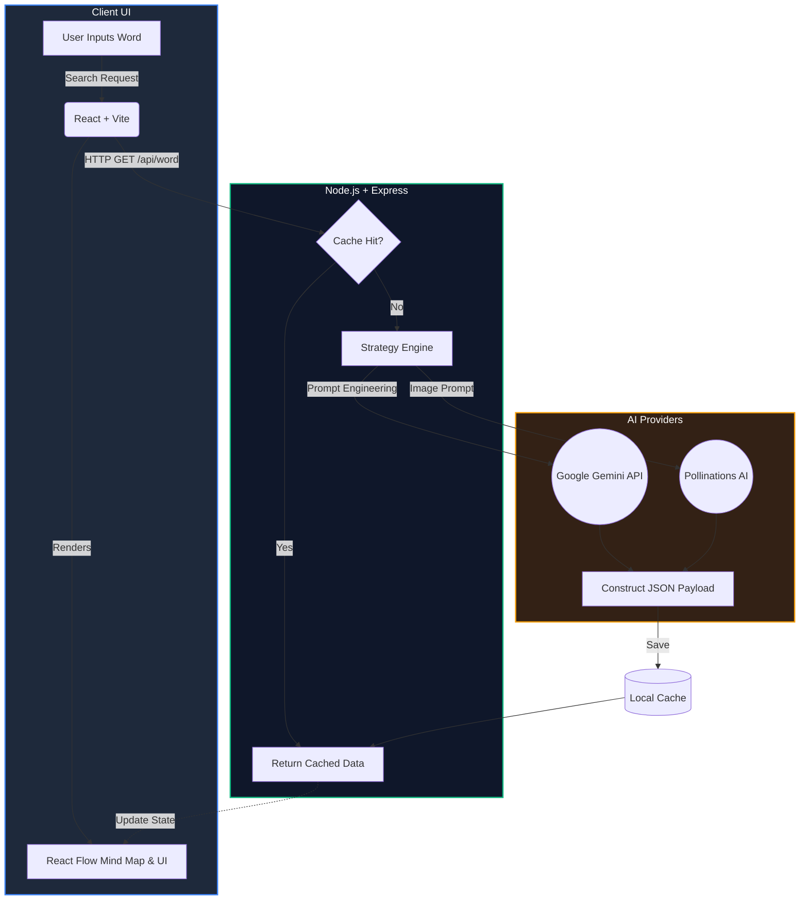

# Language Detective 

[](https://github.com/goktugcakiroglu/language-learning-app/actions/workflows/node-ci.yml)

Language Detective is a professional, global SaaS MVP designed to transform vocabulary acquisition into a visual and interactive "rabbit hole" experience. Rather than serving as a standard dictionary, it acts as a semantic exploration engine powered by AI.

## Key Features

* **Interactive Linguistic Mind Maps:** Built with React Flow, visualizing etymology, prefixes, suffixes, synonyms, and antonyms dynamically.
* **Semantic Clustering (Rabbit Hole Effect):** Users can seamlessly jump from one related concept to another without reloading, creating an infinite learning loop.
* **AI Visual Memory:** Integrates directly with Pollinations AI to generate stunning, context-aware imagery based on prompt-engineered linguistic data.
* **Strict English-First Output:** Backed by strict prompt engineering ensuring all definitions, context tags, and explanations are output in professional-grade English.
* **Cache-First Architecture:** Eliminates redundant API calls and prevents quota exhaustion by storing previously analyzed words in a local cache.

## Tech Stack

* **Frontend:** React, Tailwind CSS, React Flow, Lucide Icons
* **Backend:** Node.js, TypeScript, Express.js
* **AI & Data:** Google Gemini API, Pollinations AI (Image Generation)

## Folder Structure

The project follows a highly modular, clean architecture ready for future scaling:

```text
    language-learning-app/
├── .github/
│   └── workflows/
│       └── node-ci.yml                     # GitHub Actions CI/CD test runner
├── backend/                                # Node.js + Express Backend
│   ├── src/
│   │   ├── controllers/
│   │   │   └── WordController.ts           # Handles incoming HTTP requests & responses
│   │   ├── factories/
│   │   │   └── LanguageStrategyFactory.ts  # Factory pattern for language strategies
│   │   ├── repositories/
│   │   │   ├── GeminiWordRepository.ts     # Concrete AI data implementation
│   │   │   └── IWordRepository.ts          # Data access abstraction interface
│   │   ├── routes/
│   │   │   └── wordRoutes.ts               # API endpoint definitions
│   │   ├── services/
│   │   │   └── WordService.ts              # Core business logic and orchestration
│   │   ├── strategies/
│   │   │   └── EnglishStrategy.ts          # Strategy pattern for English output
│   │   ├── types/
│   │   │   └── index.ts                    # Backend TypeScript interfaces
│   │   ├── utils/                          # Helper functions and utilities
│   │   ├── app.ts                          # Express configuration & middleware
│   │   └── server.ts                       # Backend entry point
│   ├── .env                                # Environment variables (API keys)
│   ├── package.json
│   └── tsconfig.json
│
└── frontend/                               # React + Vite + Tailwind Frontend
    ├── public/                             # Public static assets
    ├── src/
    │   ├── assets/
    │   │   ├── hero.png                    # App graphics and illustrations
    │   │   ├── react.svg
    │   │   └── vite.svg
    │   ├── components/
    │   │   ├── WordCard.tsx                # UI component for word dictionary details
    │   │   └── WordGraph.tsx               # React Flow interactive mind map
    │   ├── features/                       # Feature-based modular logic
    │   ├── hooks/                          # Custom React hooks for state/lifecycle
    │   ├── services/
    │   │   └── api.ts                      # Axios/Fetch client for backend endpoints
    │   ├── store/                          # Global state management
    │   ├── types/
    │   │   └── index.ts                    # Frontend TypeScript interfaces
    │   ├── App.css
    │   ├── App.tsx                         # Main application layout component
    │   ├── index.css                       # Global styles and Tailwind directives
    │   └── main.tsx                        # Frontend DOM entry point
    ├── .gitignore
    ├── package.json
    └── tsconfig.json
```

## Getting Started

### Prerequisites
* Node.js (v18 or higher)
* A valid Google Gemini API Key

### Installation & Running the App

You can set up the entire project by running the following commands in your terminal:

    # 1. Clone the repository
    git clone https://github.com/goktugcakiroglu/language-learning-app.git
    cd language-learning-app

    # 2. Install Backend Dependencies
    cd backend
    npm install
    # IMPORTANT: Create a .env file inside the 'backend' folder and add: GEMINI_API_KEY=your_api_key_here

    # 3. Install Frontend Dependencies
    cd ../frontend
    npm install

    # 4. Start the Application
    # You will need two separate terminal windows to run both servers simultaneously:
    # Terminal 1 (Backend): cd backend && npm run dev
    # Terminal 2 (Frontend): cd frontend && npm run dev

## Architecture Highlights

* **Strategy Pattern:** The application logic utilizes the Strategy Pattern (e.g., `EnglishStrategy.ts`) to allow seamless scalability for future multi-language support.
* **Auto-Fit Graph Layout:** React Flow's canvas automatically scales and centers (`fitView`) to maintain a clean UI regardless of monitor size or data complexity.

### System Flow & AI Integration


